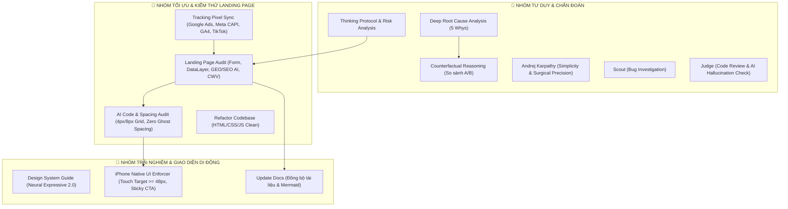

# 🛡️ CẨM NĂNG SỬ DỤNG HỆ THỐNG SKILLS — AUTO 28 LANDING PAGE

Chào mừng bạn đến với **Cẩm nang Vận hành Kỹ thuật** của dự án **Auto 28 Standalone Landing Page**. Tài liệu này tổng hợp 13 core skills tinh gọn dành riêng cho phát triển web tĩnh/landing page cao cấp.

---

## 🗺️ BẢN ĐỒ TỔNG QUAN 13 CORE SKILLS

---

## 🛠️ CHI TIẾT 13 CORE SKILLS DỰ ÁN

### 1. 🚀 `landing-page-audit` (Trọng tâm Đánh giá Landing Page)
* **Mục tiêu**: Kiểm thử tự động và chấm điểm chất lượng kỹ thuật Landing Page (HTML5 Form, DataLayer Push server-side, Anti-Spam submit `disabled`, Core Web Vitals LCP < 2.5s, GEO/SEO AI với `<table>`/`<ol>`/JSON-LD FAQ).
* **Script thực thi**: `node .agent/skills/landing-page-audit/scripts/audit-helper.js` (Yêu cầu đạt 90 - 100đ).

### 2. 📐 `ai-code-spacing-audit` (Chuẩn hóa Spacing & Giao diện)
* **Mục tiêu**: Triệt tiêu các lỗi Spacing số lẻ (chỉ dùng bội số 4px/8px), loại bỏ khoảng trống ma (Ghost Spacing), tình trạng lồng thẻ thừa (`div-itis`) và lộ API keys.

### 3. 🎯 `tracking-pixel-sync` (Đồng bộ Mã Theo dõi Chuyển đổi)
* **Mục tiêu**: Đảm bảo toàn bộ các mã tracking pixels (Google Ads, GA4, Facebook Meta CAPI, TikTok Pixel) được đồng bộ nhất quán ở tất cả entry points (`index.html`, `vf3.html`, `vf5.html`, `vf8.html`, `vf9.html`...).

### 4. 📱 `iphone-native-ui-enforcer` (Giao diện Di động Cao cấp)
* **Mục tiêu**: Đảm bảo giao diện di động mượt mà như app iPhone native: Vùng chạm (Touch Target) >= 48px, Sticky CTA Bar (Bộ đôi nút Gọi điện & Chat Zalo bám dính chân màn hình), Safe Area Padding (`env(safe-area-inset-bottom)`).

### 5. 🎨 `design-system-guide` (Neural Expressive 2.0)
* **Mục tiêu**: Áp dụng ngôn ngữ thiết kế Liquid Glassmorphic, hiệu ứng mờ kính đa tầng, typography hiện đại và màu sắc harmonious cho toàn bộ các trang dòng xe VinFast.

### 6. 🧠 `thinking-protocol` (Động Cơ Tư Duy Mở Rộng)
* **Mục tiêu**: Phân tích ẩn ý người dùng, phân loại độ phức tạp task, khai báo Confidence Scale và liệt kê 3 rủi ro kỹ thuật lớn nhất trước khi can thiệp mã nguồn.

### 7. ⚖️ `counterfactual-reasoning` (Lập luận Phản thực)
* **Mục tiêu**: Ngăn chặn "giải pháp đầu tiên xuất hiện trong đầu". Buộc AI phản biện và so sánh ít nhất 2 - 3 phương án kỹ thuật (A/B/C) kèm ưu/nhược điểm (trade-offs) trước khi chốt giải pháp.

### 8. 🔍 `deep-root-cause-analysis` (Chẩn đoán 5 Whys)
* **Mục tiêu**: Tuyệt đối cấm band-aid fixes (sửa bề mặt). Đọc log/mã thực tế, áp dụng 5 Whys tìm nguyên nhân kiến trúc gốc rễ và lập Fix Plan trước khi sửa code.

### 9. ✂️ `andrej-karpathy` (Karpathy Mode - Tối giản & Nội soi)
* **Mục tiêu**: Đề cao sự đơn giản, không over-engineering. Chỉ sửa đúng những dòng code bị ảnh hưởng (Surgical Precision), giữ nguyên style code hiện tại.

### 10. 🕵️ `scout` (Điều tra Bug & Reproduction)
* **Mục tiêu**: Tìm từng bước tái hiện bug (reproduction steps), xác định chính xác file và dòng code gây lỗi.

### 11. ⚖️ `judge` (Code Review & AI Hallucination Check)
* **Mục tiêu**: Quét code tự động để phát hiện các đoạn code ảo (hallucinated functions/variables) hoặc vi phạm luật dự án.

### 12. 🔄 `refactor-codebase` (Refactor Mã nguồn Tinh gọn)
* **Mục tiêu**: Chuẩn hóa HTML5/CSS/Vanilla JS, loại bỏ code thừa, tối ưu dung lượng trang và đảm bảo tính nhất quán giữa các trang xe.

### 13. 📝 `update-docs` (Đồng bộ Tài liệu & Mermaid)
* **Mục tiêu**: Cập nhật file `README.md`, `SKILLS_MANUAL.md` và sơ đồ Mermaid ngay khi có thay đổi cấu trúc hoặc logic dự án.

---

> [!IMPORTANT]
> **Vận hành tự động & Tối ưu Token**: Bộ 13 Skills này cùng với **Token Efficiency Protocol** (Đọc code phẫu thuật, Progressive Loading, Audit Log Offloading) đã được tích hợp trực tiếp vào tệp quy tắc [`.agents/AGENTS.md`](file:///Users/phanvu/Desktop/lading-page/.agents/AGENTS.md) và [`.agent/AGENTS.md`](file:///Users/phanvu/Desktop/lading-page/.agent/AGENTS.md) để AI tự động vận hành và giữ ngữ cảnh làm việc tinh gọn trong mọi phiên.
