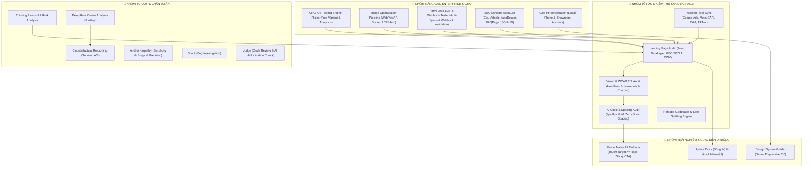

# 🛡️ CẨM NĂNG SỬ DỤNG HỆ THỐNG SKILLS — AUTO 28 LANDING PAGE (v3.0)

Chào mừng bạn đến với **Cẩm nang Vận hành Kỹ thuật** của dự án **Auto 28 Standalone Landing Page**. Tài liệu này tổng hợp 22 core skills chuyên sâu dành riêng cho phát triển web tĩnh/landing page cao cấp.

---

## 🗺️ BẢN ĐỒ TỔNG QUAN 22 CORE SKILLS

---

## 🛠️ CHI TIẾT 22 CORE SKILLS DỰ ÁN

### 1. 🚀 `landing-page-audit` (Trọng tâm Đánh giá Landing Page)
* **Mục tiêu**: Kiểm thử tự động và chấm điểm chất lượng kỹ thuật Landing Page (HTML5 Form, DataLayer Push server-side, Anti-Spam submit `disabled`, Core Web Vitals LCP < 2.5s, GEO/SEO AI với `<table>`/`<ol>`/JSON-LD FAQ).
* **Script thực thi**: `node .agents/skills/landing-page-audit/scripts/audit-helper.js` (Yêu cầu đạt 90 - 100đ).

### 2. 👁️ `visual-wcag-audit` (Kiểm thử Thị giác & Accessibility Đa Thiết bị)
* **Mục tiêu**: Engine kiểm thử thị giác Headless Chrome – Tự động chụp ảnh Full-Page & Viewport trên Mobile/Tablet/Desktop, đo đạc WCAG 2.2 Color Contrast Ratio và Touch Target Size (>= 48px).

### 3. 📐 `ai-code-spacing-audit` (Chuẩn hóa Spacing & Giao diện)
* **Mục tiêu**: Triệt tiêu các lỗi Spacing số lẻ (chỉ dùng bội số 4px/8px), loại bỏ khoảng trống ma (Ghost Spacing), tình trạng lồng thẻ thừa (`div-itis`) và lộ API keys.

### 4. 🎯 `tracking-pixel-sync` (Đồng bộ Mã Theo dõi Chuyển đổi)
* **Mục tiêu**: Đảm bảo toàn bộ các mã tracking pixels (Google Ads, GA4, Facebook Meta CAPI, TikTok Pixel) được đồng bộ nhất quán ở tất cả entry points (`index.html`, `vf3.html`, `vf5.html`, `vf8.html`, `vf9.html`...).

### 5. ⚡ `cro-ab-testing-engine` (Thử nghiệm Biến thể & CRO)
* **Mục tiêu**: Thiết lập và quản lý các thử nghiệm biến thể A/B/n (Hero Banner, tiêu đề, màu nút CTA, layout Form), ngăn ngừa nhấp nháy giao diện (Flicker-Free) và đồng bộ sự kiện `ab_test_exposure` tới DataLayer.

### 6. 🖼️ `image-optimization-pipeline` (Tối ưu Ảnh WebP/AVIF & LCP)
* **Mục tiêu**: Tự động chuyển đổi và nén ảnh sang định dạng WebP/AVIF (< 250KB), sinh thẻ `<picture>` đa độ phân giải (`srcset`), gắn `fetchpriority="high"` cho Hero Image để đạt chỉ số LCP < 2.5s.

### 7. 🧪 `form-e2e-webhook-tester` (Kiểm thử Form Lead & Webhook CRM)
* **Mục tiêu**: Quy trình kiểm thử liên hoàn End-to-End từ khi khách điền Form đến khi dữ liệu bắn về Webhook CRM / Google Sheets, xác minh Anti-Spam và Modal cảm ơn.

### 8. 🔍 `seo-schema-autogen` (Tự động Sinh Schema JSON-LD)
* **Mục tiêu**: Tạo và đồng bộ dữ liệu có cấu trúc Schema.org JSON-LD (`Car`, `Vehicle`, `AutoDealer`, `Offer`, `FAQPage`) cho tất cả các trang dòng xe VinFast.

### 9. 📍 `geo-personalization` (Cá nhân hóa Theo Vị trí Địa lý)
* **Mục tiêu**: Tự động cập nhật SĐT Hotline và Địa chỉ Showroom tương ứng với Tỉnh/Thành của khách hàng truy cập (Hà Nội, TP.HCM, Đà Nẵng).

### 10. 🛡️ `safe-file-refactor` (Safe File Refactoring & Splitting Engine)
* **Mục tiêu**: Engine phân tách tệp lớn (`main.js`, `style.css`, `cars_data.js`) theo chuẩn Martin Fowler 2026 với 3 tầng verification gate không sơ suất.

### 11. 📱 `iphone-native-ui-enforcer` (Giao diện Di động Cao cấp)
* **Mục tiêu**: Đảm bảo giao diện di động mượt mà như app iPhone native: Vùng chạm (Touch Target) >= 48px, Safe Area Padding (`env(safe-area-inset-bottom)`). CẤM Mobile Sticky CTA Bar.

### 12. 🎨 `design-system-guide` (Neural Expressive 2.0)
* **Mục tiêu**: Áp dụng ngôn ngữ thiết kế Liquid Glassmorphic, hiệu ứng mờ kính đa tầng, typography hiện đại và màu sắc harmonious cho toàn bộ các trang dòng xe VinFast.

### 13. 🧠 `thinking-protocol` (Động Cơ Tư Duy Mở Rộng)
* **Mục tiêu**: Phân tích ẩn ý người dùng, phân loại độ phức tạp task, khai báo Confidence Scale và liệt kê 3 rủi ro kỹ thuật lớn nhất trước khi can thiệp mã nguồn.

### 14. ⚖️ `counterfactual-reasoning` (Lập luận Phản thực)
* **Mục tiêu**: Ngăn chặn "giải pháp đầu tiên xuất hiện trong đầu". Buộc AI phản biện và so sánh ít nhất 2 - 3 phương án kỹ thuật (A/B/C) kèm ưu/nhược điểm (trade-offs) trước khi chốt giải pháp.

### 15. 🔍 `deep-root-cause-analysis` (Chẩn đoán 5 Whys)
* **Mục tiêu**: Tuyệt đối cấm band-aid fixes (sửa bề mặt). Đọc log/mã thực tế, áp dụng 5 Whys tìm nguyên nhân kiến trúc gốc rễ và lập Fix Plan trước khi sửa code.

### 16. ✂️ `andrej-karpathy` (Karpathy Mode - Tối giản & Nội soi)
* **Mục tiêu**: Đề cao sự đơn giản, không over-engineering. Chỉ sửa đúng những dòng code bị ảnh hưởng (Surgical Precision), giữ nguyên style code hiện tại.

### 17. 🕵️ `scout` (Điều tra Bug & Reproduction)
* **Mục tiêu**: Tìm từng bước tái hiện bug (reproduction steps), xác định chính xác file và dòng code gây lỗi.

### 18. ⚖️ `judge` (Code Review & AI Hallucination Check)
* **Mục tiêu**: Quét code tự động để phát hiện các đoạn code ảo (hallucinated functions/variables) hoặc vi phạm luật dự án.

### 19. 🔄 `refactor-codebase` (Refactor Mã nguồn Tinh gọn)
* **Mục tiêu**: Chuẩn hóa HTML5/CSS/Vanilla JS, loại bỏ code thừa, tối ưu dung lượng trang và đảm bảo tính nhất quán giữa các trang xe.
* **⚠️ CẢNH BÁO TƯƠNG THÍCH**: Skill này chứa code mẫu React/TypeScript không phù hợp với dự án **Vanilla HTML/CSS/JS** này. Chỉ sử dụng phần workflow & checklist, **KHÔNG** áp dụng TypeScript patterns.

### 20. 📝 `update-docs` (Đồng bộ Tài liệu & Mermaid)
* **Mục tiêu**: Cập nhật file `README.md`, `SKILLS_MANUAL.md` và sơ đồ Mermaid ngay khi có thay đổi cấu trúc hoặc logic dự án.

### 21. 📁 `file-structure-standard` (Tiêu chuẩn Đặt tên File & Thư mục)
* **Mục tiêu**: Kiểm tra và thực thi tiêu chuẩn quốc tế về đặt tên file và cấu trúc thư mục. Bắt buộc sử dụng lowercase + kebab-case cho mọi file web.

### 22. 🌐 `lang-standards-guardian` (Tiêu chuẩn Ngôn ngữ Quốc tế)
* **Mục tiêu**: Kiểm tra và thực thi tiêu chuẩn ngôn ngữ cho 4 tầng kỹ thuật: HTML5, CSS W3C L4, JS ES2025, Node.js OWASP.

---

> [!IMPORTANT]
> **Vận hành tự động & Tối ưu Token**: Bộ 22 Skills này đã được tích hợp trực tiếp vào tệp quy tắc [`.agents/AGENTS.md`](file:///Users/phanvu/Desktop/lading-page/.agents/AGENTS.md) theo kiến trúc Modular v3.0 và hệ thống lưu trữ bộ nhớ `.agents/scratch/`.

> [!NOTE]
> **Cập nhật lần cuối**: 2026-08-11 — Cập nhật kiến trúc Modular v3.0, bổ sung §18 Reflection Gate & §19 Memory Protocol.

