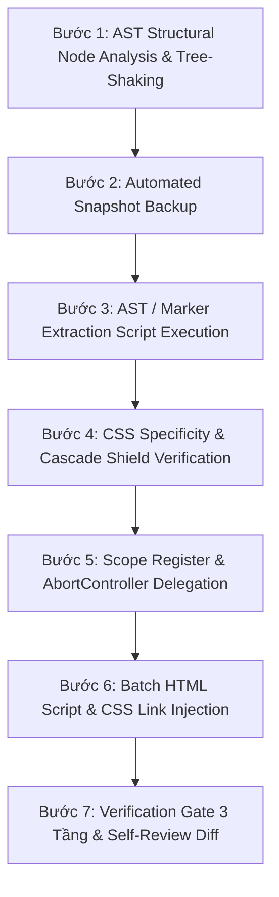

# 🛡️ Safe File Refactoring & Splitting Engine (Tier-1 Enterprise Zero-Defect Protocol)

Chỉ dẫn chuyên sâu theo tiêu chuẩn công nghiệp tập đoàn công nghệ (Tier-1 Enterprise) dành cho AI Agent để thực hiện việc phân tách và tái cấu trúc các tệp mã nguồn lớn (`main.js`, `style.css`, `cars_data.js`, các tệp HTML khối lượng lớn) trong hệ sinh thái dự án Auto 28 mà **không xảy ra bất kỳ sơ suất, mất mát logic, hay vỡ giao diện nào**.

---

## 🎯 1. NGUYÊN TẮC CỐ ĐỊNH (NON-NEGOTIABLE ENTERPRISE PROTOCOLS)

1. **Tuyệt đối không cắt dòng tĩnh (No Hardcoded Line-Slicing)**: Nghiêm cấm dùng dải dòng tĩnh `lines.slice()`. AI BẮT BUỘC phải dùng **AST Structural Node Parser** (tìm ranh giới khối ngoặc nhọn `{ ... }` và cú pháp AST) hoặc **Marker/Signature-based Regex Extraction** để trích xuất khối hàm chính xác 100%.
2. **Cơ chế Sao lưu Snapshot (Automated Snapshot Backup Protocol)**: Trước khi ghi đè hoặc chỉnh sửa bất kỳ tệp lớn nào (> 300 dòng), Agent BẮT BUỘC phải tự động tạo bản sao lưu snapshot tại `.agent/scratch/backups/<filename>.<timestamp>.bak`.
3. **Bảo toàn Tracking DataLayer & Hash Matrix**: Refactoring chỉ cải thiện cấu trúc bên trong. TUYỆT ĐỐI KHÔNG vừa tách file vừa thay đổi logic kinh doanh. BẮT BUỘC bảo tồn 100% các sự kiện `window.dataLayer.push({ event: 'form_lead_success', ... })` và Tracking Pixels (GA4, Facebook Pixel, TikTok Pixel).
4. **Bảo vệ Thứ tự CSS Cascading & Specificity Shield**: Khi phân tách `style.css`, BẮT BUỘC phải kiểm soát thứ tự `@import` / `<link>`, bảo toàn hệ thống 8pt Grid spacing và biến CSS Token (`var(--spacing-md)`), triệt tiêu hoàn toàn lỗi **Ghost Spacing** (khoảng trắng ma).
5. **Cross-File Tree-Shaking & Dead Code Purging**: Quét ma trận phụ thuộc chéo giữa 8+ trang HTML và tất cả các file JS để phát hiện code chết hoặc hàm không sử dụng trước khi tách, chống việc "chuyển rác sang file mới".
6. **Event Lifecycle với `AbortController`**: Sử dụng Event Delegation trên `document` kết hợp với `AbortController` signal để quản lý vòng đời sự kiện, triệt tiêu rò rỉ bộ nhớ (Memory Leak) khi DOM re-render hoặc modal đóng/mở.
7. **Nghiệm thu 3 Tầng bắt buộc (Mandatory 3-Tier Verification Gate)**:
   - **Tầng 1 (Syntax Gate)**: Chạy `node --check <file>` xác minh cú pháp không có lỗi.
   - **Tầng 2 (Audit Gate)**: Chạy `node .agent/skills/landing-page-audit/scripts/audit-helper.js` (Yêu cầu đạt **90 - 100 điểm**).
   - **Tầng 3 (Hygiene Gate)**: Chạy `node scripts/code_hygiene_check.js` (Triệt tiêu token drift và rác comment).

---

## 📐 2. QUY TRÌNH 7 BƯỚC THỰC THI CHUẨN TIER-1 ENTERPRISE



### Bước 1: AST Structural Node Analysis & Tree-Shaking
Đọc tệp gốc và xây dựng cây phụ thuộc AST:
- **Global Exports**: Hàm gọi trực tiếp từ HTML (`onclick="openCarModal()"`).
- **Internal Helpers**: Hàm nội bộ chỉ dùng riêng trong module.
- **Analytics Trackers**: Các khối `window.dataLayer.push({ event: ... })` (Giữ nguyên 100%).
- **Tree-Shaking Check**: Quét chéo với các trang HTML để phát hiện mã không sử dụng.

### Bước 2: Automated Snapshot Backup
Chạy script tạo bản sao lưu an toàn tại `.agent/scratch/backups/`:
```bash
mkdir -p .agent/scratch/backups
cp main.js .agent/scratch/backups/main.js.$(date +%s).bak
```

### Bước 3: AST Node Extraction Script Execution
Viết script Node.js trích xuất khối hàm dựa trên AST Node Parser (xem tài liệu tham chiếu [REF_ADVANCED_REFACTORING.md](file:///Users/phanvu/Desktop/lading-page/.agents/skills/safe-file-refactor/references/REF_ADVANCED_REFACTORING.md)), đảm bảo ranh giới khối mã được đóng mở chính xác 100%.

### Bước 4: CSS Specificity & Cascade Shield Verification
Nếu phân tách tệp CSS:
- Đảm bảo các biến CSS Token (`:root`) được nạp đầu tiên.
- Giữ nguyên thứ tự nạp stylesheet để tránh hiện tượng override Specificity không mong muốn.

### Bước 5: Scope Register & AbortController Delegation
- Gán explicit window scope cho HTML callable functions: `window.functionName = functionName;`.
- Gán listener với AbortController:
```javascript
const controller = new AbortController();
document.addEventListener('click', (e) => {
  const btn = e.target.closest('[data-action="open-modal"]');
  if (btn) handleOpenModal(btn);
}, { signal: controller.signal });
```

### Bước 6: Batch Injection trên Toàn Bộ HTML Pages
Chạy script Node.js tự động cập nhật `<script defer src="js/modules/...">` và `<link rel="stylesheet">` đồng bộ trên tất cả 8+ tệp `.html` trong dự án.

### Bước 7: Kiểm Thử Nghiệm Thu 3 Tầng (Verification Gate)
1. **Kiểm tra cú pháp**: `node --check js/modules/your-module.js`
2. **Kiểm tra Landing Page Standards**: `node .agent/skills/landing-page-audit/scripts/audit-helper.js` (Yêu cầu 90+ điểm).
3. **Kiểm tra Vệ sinh Mã nguồn**: `node scripts/code_hygiene_check.js`

---

## 📜 3. TEMPLATE SCRIPT AST PARSER ENGINE (ZERO-DEPENDENCY)

Mẫu script Node.js AST Parser Engine chuẩn Tier-1 Enterprise (trích xuất khối ngoặc nhọn bằng thuật toán đếm ngoặc AST Brace Matching):

```javascript
// File: .agent/scratch/ast_split_module.js
const fs = require('fs');
const path = require('path');
const { execSync } = require('child_process');

const sourcePath = path.join(__dirname, '../../main.js');
const targetDir = path.join(__dirname, '../../js/modules');
const backupDir = path.join(__dirname, '../backups');

if (!fs.existsSync(backupDir)) fs.mkdirSync(backupDir, { recursive: true });
if (!fs.existsSync(targetDir)) fs.mkdirSync(targetDir, { recursive: true });

// Backup snapshot
const timestamp = Date.now();
fs.copyFileSync(sourcePath, path.join(backupDir, `main.${timestamp}.bak`));

const code = fs.readFileSync(sourcePath, 'utf8');

// Thuật toán AST Brace Matching
function extractASTFunction(source, fnName) {
  const regex = new RegExp(`(?:async\\s+)?function\\s+${fnName}\\s*\\(([^)]*)\\)\\s*\\{`, 'g');
  const match = regex.exec(source);
  if (!match) throw new Error(`Function ${fnName} not found in AST AST scan!`);

  const startIndex = match.index;
  let braceCount = 1;
  let curr = startIndex + match[0].length;

  while (braceCount > 0 && curr < source.length) {
    if (source[curr] === '{') braceCount++;
    else if (source[curr] === '}') braceCount--;
    curr++;
  }

  return source.substring(startIndex, curr);
}

const extractedModalCode = extractASTFunction(code, 'openCarModal');

const moduleContent = `/**
 * Auto 28 Landing Page - AST Extracted Module
 */
(function() {
  'use strict';
  const controller = new AbortController();

  ${extractedModalCode}

  window.openCarModal = openCarModal;
})();
`;

const outputFile = path.join(targetDir, 'car-modal.js');
fs.writeFileSync(outputFile, moduleContent, 'utf8');

// Syntax Check Gate
try {
  execSync(`node --check ${outputFile}`);
  console.log('✅ AST Node Extraction & Syntax Verification Passed!');
} catch (e) {
  console.error('❌ Syntax Failed! Rolling back...');
  fs.copyFileSync(path.join(backupDir, `main.${timestamp}.bak`), sourcePath);
  process.exit(1);
}
```

---

## 📚 4. TÀI LIỆU THAM CHIẾU KỸ THUẬT NÂNG CAO

Để xem các đoạn mã helper tái sử dụng hoàn chỉnh về **Recursive Descent AST Parser**, **CSS Specificity Score Calculator**, và **Static Tree-Shaking Analyzer**, vui lòng xem tệp tham chiếu:
👉 [REF_ADVANCED_REFACTORING.md](file:///Users/phanvu/Desktop/lading-page/.agents/skills/safe-file-refactor/references/REF_ADVANCED_REFACTORING.md)

---

## 🚨 5. MA TRẬN PHÁT HIỆN & XỬ LÝ LỖI SƠ SUẤT (TROUBLESHOOTING MATRIX)

| Lỗi phát sinh | Nguyên nhân gốc rễ | Giải pháp xử lý Tier-1 Enterprise |
| :--- | :--- | :--- |
| `ReferenceError: fn is not defined` | Hàm bị bọc kín trong module scope, HTML không gọi được. | Gán rõ `window.fn = fn;` ở cuối module. |
| Click nút không hoạt động sau re-render | Listener bị mất khi DOM re-render. | Chuyển listener sang Event Delegation `document.addEventListener('click', ...)` với `AbortController`. |
| Sót sự kiện GA4 / Meta Pixel | Quên cắt khối `window.dataLayer.push`. | Khóa payload với `extractDataLayerEvents()` trong AST Parser. |
| Trôi dạt Spacing / vỡ layout CSS | Tách CSS sai thứ tự Cascading hoặc dùng Spacing số lẻ. | Chạy `calculateSpecificity()` kiểm tra và bảo toàn chuỗi `@import` CSS Token. |
| Dòng bị lệch gây mất code | Dùng `lines.slice(start, end)` tĩnh. | Nghiêm cấm dải dòng tĩnh. Bắt buộc dùng AST Brace Matcher Engine. |
